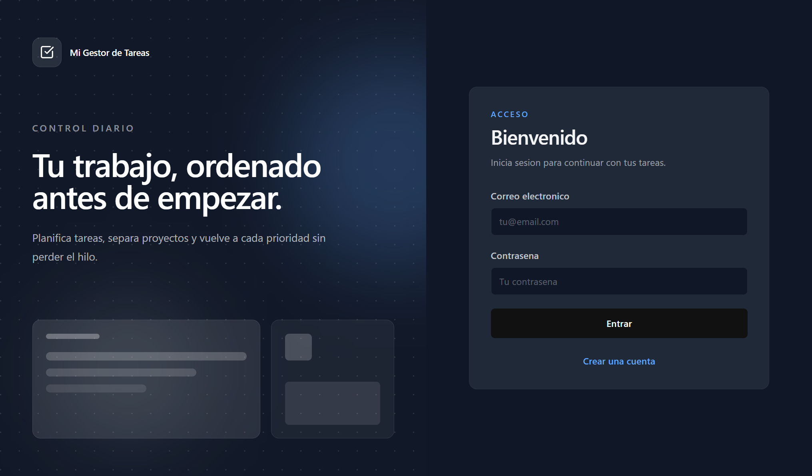
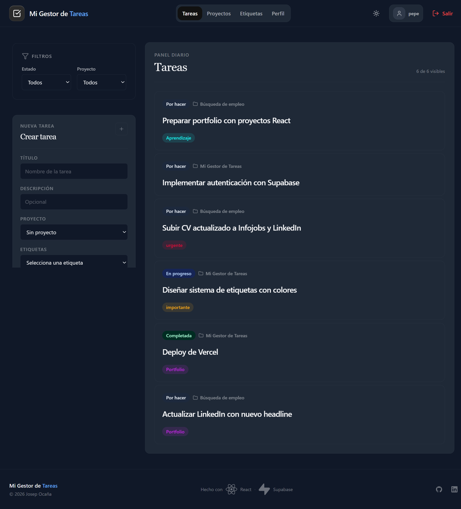
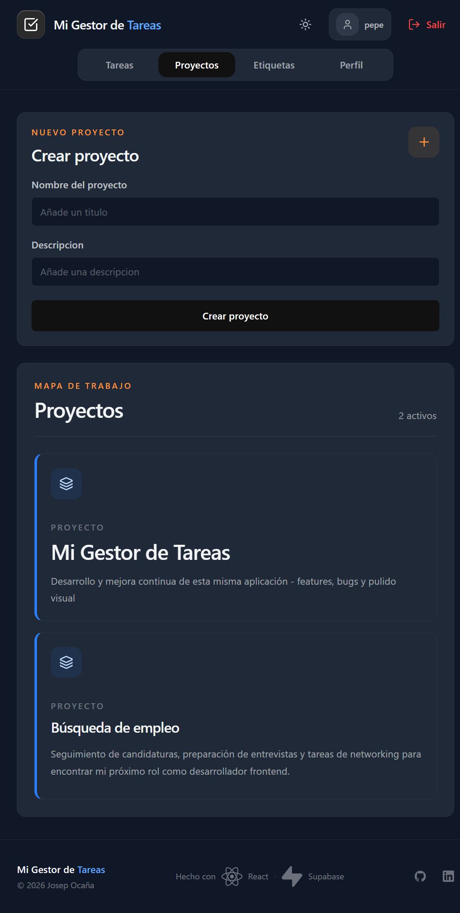
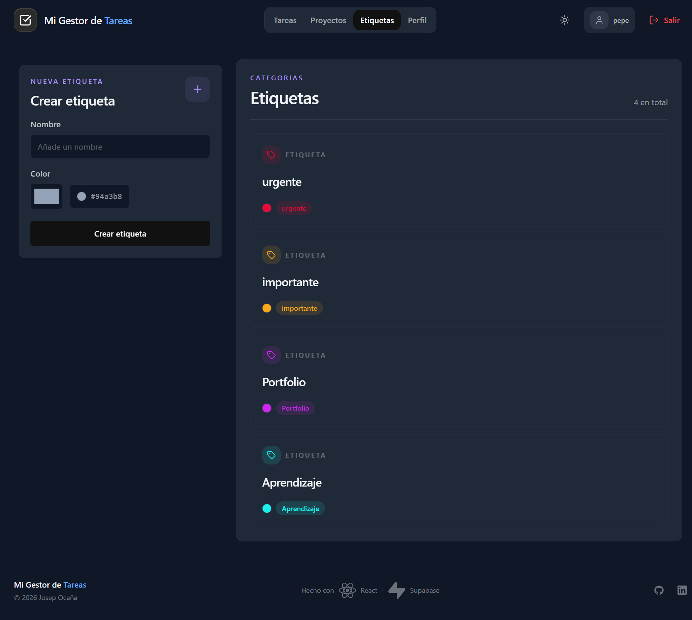
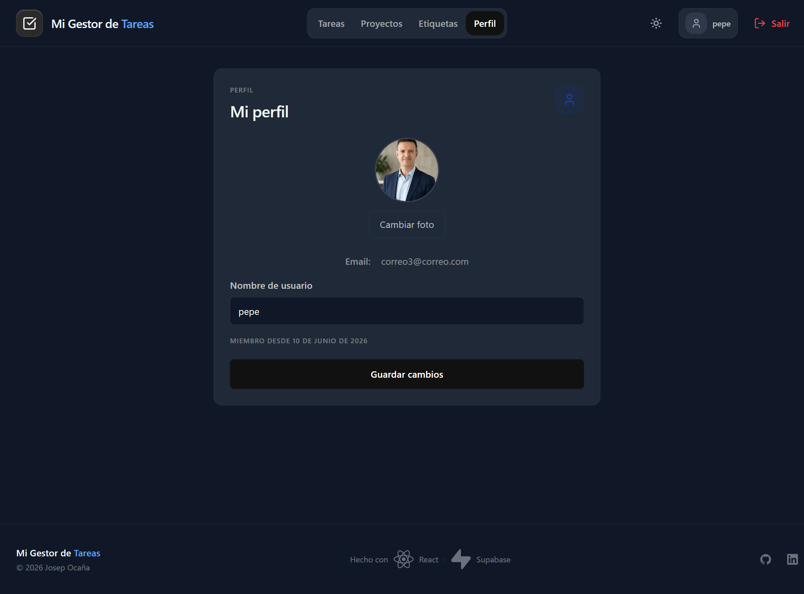

# Mi Gestor de Tareas

A full-stack task management application built with React and Supabase. Organize your work by creating tasks, grouping them into projects, and tagging them for quick filtering.

🔗 **[Live Demo](https://mi-gestor-de-tareas-josep.vercel.app)**

---

## Screenshots







---

## Features

- **Authentication** — Sign up and sign in with email and password via Supabase Auth
- **Tasks** — Full CRUD with status tracking (To do, In progress, Done), project assignment and tag filtering
- **Projects** — Group tasks by project to keep work organized
- **Tags** — Create color-coded tags and assign them to tasks
- **Profile** — Update username and upload a profile avatar to Supabase Storage
- **Dark mode** — System-aware theme toggle with persistent preference
- **Responsive** — Works on mobile and desktop

---

## Tech Stack

| Layer    | Technology                           |
| -------- | ------------------------------------ |
| Frontend | React 19, TypeScript, Vite           |
| Styling  | Tailwind CSS v4                      |
| Backend  | Supabase (PostgreSQL, Auth, Storage) |
| Forms    | React Hook Form + Zod                |
| Routing  | React Router v6                      |
| Deploy   | Vercel                               |

---

## Architecture

```
src/
├── context/         # Auth, Theme, Tasks, Projects, Tags — useReducer + Context
├── features/        # Pages and components grouped by domain
│   ├── auth/
│   ├── tasks/
│   ├── projects/
│   ├── tags/
│   └── profile/
├── components/
│   ├── layout/      # Header, Footer, PrivateLayout
│   └── ui/          # Reusable primitives (icons, theme toggle)
└── types/           # Shared TypeScript types
```

---

## Getting Started

### Prerequisites

- Node.js 18+
- A [Supabase](https://supabase.com) project

### Installation

```bash
# Clone the repository
git clone https://github.com/Josep-Ocana/mi-gestor-de-tareas.git
cd mi-gestor-de-tareas/frontend

# Install dependencies
npm install

# Set up environment variables
cp .env.example .env.local
```

Add your Supabase credentials to `.env.local`:

```env
VITE_SUPABASE_URL=your_supabase_url
VITE_SUPABASE_ANON_KEY=your_supabase_anon_key
```

```bash
# Start the development server
npm run dev
```

---

## Database Schema

Five tables with Row Level Security (RLS) enabled:

- `profiles` — linked to `auth.users`, stores username and avatar
- `tasks` — title, description, status, project and owner
- `projects` — name, description and owner
- `tags` — name, color and owner
- `task_tags` — many-to-many join table between tasks and tags

---

## Author

**Josep Ocaña Puigdevall**
Frontend Developer · React & TypeScript · Full Stack with Supabase

[LinkedIn](https://www.linkedin.com/in/josep-oca%C3%B1a-2573a1416/) · [GitHub](https://github.com/Josep-Ocana)

---

## License

MIT
